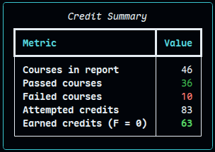
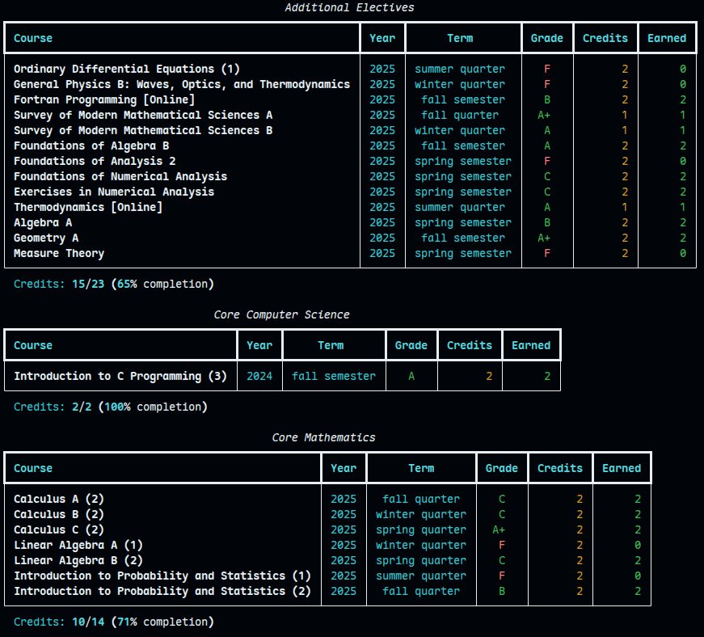

# waseda-credit-calculator

A command-line tool for calculating things about credits at Waseda University, made because the credit system is so god damn complex.

The credit calculation rule is based on the 2023 curriculum from the Waseda FSE Handbook, and only supports the CSCE major. Because I am a CSCE student enrolled in 2023.

Basically, this tool is made for myself. However, I made it open source in case other people find it useful. You can fork and modify it to support your major and the curriculum you are enrolled in.

## Installation

Using uv (recommended):

```bash
uv tool install waseda-credit-calculator
```

Using pip:

```bash
pip install waseda-credit-calculator
```

## Usage

To see all the available commands, run:

```bash
wcc --help
```

### Import Grade Report

To start, you need to first get a CSV file of your grade report. This only works on Chrome.

1. Install the [Instant Data Scraper](https://chromewebstore.google.com/detail/instant-data-scraper/ofaokhiedipichpaobibbnahnkdoiiah) extension.
2. Go to [MyWaseda](https://my.waseda.jp) and choose the "Grades & Course Registration" button in the bottom left. You need to be logged out to see this.
3. Click on "Grade Report" in the opened tab.
4. The newly opened tab cannot use extensions, copy the URL and open it in a new tab of the original browser window.
5. Click on the Instant Data Scraper extension icon, make sure that it's crawling the table with the grades. Click "Download CSV", then save the file somewhere.
6. Run `wcc load` and follow the instructions.

## Showcase

The showcase uses mock data.





